# 🍳 Chef Khata — AI Voice Cooking Assistant

A **free, voice-first AI cooking assistant** built with Flask, Groq's Llama 3.3 70B, and Orpheus TTS. Talk hands-free while you cook — get instant recipes, ingredient substitutions, cooking techniques, and meal planning tips through natural voice conversation.

> No sign-up. No subscriptions. No limits on fun.

---

## Table of Contents

- [Features](#-features)
- [Demo](#-demo)
- [Architecture](#-architecture)
- [Tech Stack](#-tech-stack)
- [Project Structure](#-project-structure)
- [Request Lifecycle](#-request-lifecycle)
- [Voice Agent State Machine](#-voice-agent-state-machine)
- [TTS Pipeline](#-tts-pipeline)
- [Getting Started](#-getting-started)
- [Configuration](#%EF%B8%8F-configuration)
- [API Endpoints](#-api-endpoints)
- [Privacy](#-privacy)
- [License](#-license)

---

## ✨ Features

| Feature | Description |
|---|---|
| **Voice-First** | Tap the orb and speak naturally — no typing needed |
| **Human-Like Voice** | Orpheus TTS by Canopy Labs produces warm, expressive speech |
| **Interruptible** | Start talking mid-response and Chef Khata stops to listen |
| **Context-Aware** | Maintains conversation history (last 20 messages) for follow-up questions |
| **Text Fallback** | Type your question if you prefer — text input always available |
| **Recipe Expert** | Recipes, substitutions, food science, meal planning, and dietary guidance |
| **Mobile-Ready** | Responsive design with mobile transcript panel and desktop sidebar |
| **100% Free** | Powered entirely by Groq's free API tier |

---

## 🏛 Architecture


---

## 🛠 Tech Stack

```mermaid
graph LR
    subgraph Backend
        PY["🐍 Python 3"]
        FL["⚡ Flask 3.1"]
        RQ["📡 Requests"]
        MD["📝 Markdown"]
        DE["🔐 python-dotenv"]
    end

    subgraph Frontend
        TW["🎨 Tailwind CSS (CDN)"]
        JS["💻 Vanilla JavaScript"]
        WSA2["🎙️ Web Speech API"]
        HTML["📄 Jinja2 Templates"]
    end

    subgraph AI_Services["AI Services (Groq)"]
        LLAMA["🧠 Llama 3.3 70B"]
        ORPH["🗣️ Orpheus TTS v1"]
    end

    PY --> FL
    FL --> RQ
    FL --> MD
    FL --> DE
    FL --> HTML
    HTML --> TW
    HTML --> JS
    JS --> WSA2
    RQ --> LLAMA
    RQ --> ORPH

    style Backend fill:#1a1917,stroke:#22c55e,color:#fff
    style Frontend fill:#1a1917,stroke:#f19333,color:#fff
    style AI_Services fill:#1a1917,stroke:#3b82f6,color:#fff
```



| Layer | Technology | Purpose |
|---|---|---|
| **LLM** | Llama 3.3 70B (via Groq) | Conversational AI brain — cooking knowledge |
| **TTS** | Orpheus v1 by Canopy Labs (via Groq) | Human-like voice synthesis ("Autumn" persona) |
| **STT** | Web Speech API (browser-native) | Voice input — zero cost, no extra APIs |
| **Backend** | Flask 3.1 + Python | Lightweight API server, session management |
| **Frontend** | Tailwind CSS + Vanilla JS | Responsive UI, orb animations, state machine |
| **Templating** | Jinja2 | Template inheritance for consistent pages |

---

## 📁 Project Structure


### File Breakdown

| File | Lines | Purpose |
|---|---|---|
| `app.py` | ~293 | Main Flask application — routes, Groq chat API integration, TTS generation pipeline with concurrent chunk processing, WAV concatenation, session-based conversation history |
| `requirements.txt` | 4 | `flask`, `requests`, `python-dotenv`, `markdown` |
| `templates/base.html` | ~107 | Base template — HTML head, Tailwind CDN config with custom brand colors, navigation bar, global CSS animations (fade-up, glass effect, gradient text) |
| `templates/home.html` | ~276 | Landing page — hero section with animated orb preview, 6 feature cards, 3-step "how it works", CTA section, footer |
| `templates/agent.html` | ~582 | Core voice agent page — interactive orb with 4 animation states, desktop sidebar transcript, mobile transcript panel, text input fallback, full JavaScript state machine for voice loop |
| `templates/about.html` | ~184 | About page — project story, tech stack cards (LLM, TTS, Speech API, Flask), capabilities grid, privacy notice |
| `templates/index.html` | ~553 | Standalone single-page version (legacy) |

---

## 🔄 Request Lifecycle

```mermaid
sequenceDiagram
    actor User
    participant Browser as 🖥️ Browser
    participant Flask as 🐍 Flask Server
    participant Groq_LLM as 🧠 Groq LLM API
    participant Groq_TTS as 🗣️ Groq TTS API

    User->>Browser: Tap orb / Press spacebar
    Browser->>Browser: Start Web Speech API recognition
    User->>Browser: Speak question
    Browser->>Browser: Transcribe speech → text

    rect rgb(40, 40, 35)
        Note over Browser,Groq_LLM: Chat Request
        Browser->>Flask: POST /chat {message}
        Flask->>Flask: Load session history (last 20 msgs)
        Flask->>Flask: Build messages array with system prompt
        Flask->>Groq_LLM: POST /chat/completions<br/>{model: llama-3.3-70b, messages, max_tokens: 300}
        Groq_LLM-->>Flask: {content: "recipe response..."}
        Flask->>Flask: Convert reply to HTML (markdown lib)
        Flask->>Flask: Update session history
        Flask-->>Browser: {reply, reply_html}
    end

    Browser->>Browser: Display reply_html in response card
    Browser->>Browser: Add to transcript log

    rect rgb(35, 45, 35)
        Note over Browser,Groq_TTS: TTS Request (if auto-speak ON)
        Browser->>Flask: POST /speak {text}
        Flask->>Flask: Clean text (strip markdown, emoji)
        Flask->>Flask: Split into ≤195 char chunks
        
        par Concurrent TTS generation (max 3 workers)
            Flask->>Groq_TTS: Chunk 1 → WAV
            Flask->>Groq_TTS: Chunk 2 → WAV
            Flask->>Groq_TTS: Chunk 3 → WAV
        end
        
        Groq_TTS-->>Flask: WAV audio bytes
        Flask->>Flask: Concatenate WAV chunks
        Flask-->>Browser: audio/wav (combined)
    end

    Browser->>Browser: Play audio via Audio API
    Browser->>Browser: On playback end → auto-restart listening
    Browser->>Browser: Start Web Speech API (voice loop)
```



---

## 🎯 Voice Agent State Machine

The voice agent operates as a **4-state finite state machine** that drives the orb's visual appearance and interaction behavior:

```mermaid
stateDiagram-v2
    [*] --> IDLE

    IDLE --> LISTENING: Tap orb / Spacebar
    LISTENING --> THINKING: Speech recognized
    LISTENING --> IDLE: No speech / Error
    THINKING --> SPEAKING: Response received<br/>(auto-speak ON)
    THINKING --> IDLE: Response received<br/>(auto-speak OFF)
    SPEAKING --> LISTENING: Playback complete<br/>(voice loop)
    SPEAKING --> LISTENING: User interrupts<br/>(speaks mid-playback)
    SPEAKING --> IDLE: Tap orb to stop

    state IDLE {
        [*] : 🟠 Orange orb (pulsing)
        [*] : Mic icon
        [*] : "Tap to start talking"
    }
    state LISTENING {
        [*] : 🔴 Red orb (expanding)
        [*] : Stop icon + pulse rings
        [*] : "Listening..."
    }
    state THINKING {
        [*] : 🟡 Amber orb (wobbling)
        [*] : Bouncing dots
        [*] : "Thinking..."
    }
    state SPEAKING {
        [*] : 🟢 Green orb (breathing)
        [*] : Speaker icon
        [*] : "Speaking..."
    }
```



### Orb Animations

| State | Color | Animation | CSS Class |
|---|---|---|---|
| **Idle** | Orange gradient | Gentle scale pulse (3s) | `orb-idle` |
| **Listening** | Red gradient | Expanding pulse + ring waves (1.2s) | `orb-listening` |
| **Thinking** | Amber gradient | Wobble/rotate (1.5s) | `orb-thinking` |
| **Speaking** | Green gradient | Organic breathing (0.8s) | `orb-speaking` |

---

## 🔊 TTS Pipeline

The text-to-speech pipeline handles Orpheus TTS's 200-character limit through intelligent chunking and concurrent generation:

```mermaid
flowchart TD
    INPUT["Raw LLM Response"]
    CLEAN["🧹 Clean for Speech<br/>Strip markdown: # * _ ~ ><br/>Remove emojis & URLs<br/>Normalize whitespace"]
    SPLIT["✂️ Split into Chunks<br/>≤195 chars per chunk<br/>Split at sentence boundaries<br/>Fallback: comma → word boundaries"]
    
    subgraph POOL["ThreadPoolExecutor (max 3 workers)"]
        W1["Worker 1<br/>Chunk 1 → Groq TTS"]
        W2["Worker 2<br/>Chunk 2 → Groq TTS"]
        W3["Worker 3<br/>Chunk 3 → Groq TTS"]
    end

    WAV1["WAV bytes 1"]
    WAV2["WAV bytes 2"]
    WAV3["WAV bytes 3"]

    CONCAT["🔗 Concatenate WAVs<br/>Parse headers, merge PCM data<br/>Rebuild with correct sizes"]
    OUTPUT["Combined audio/wav<br/>→ Browser Audio API"]

    INPUT --> CLEAN --> SPLIT
    SPLIT --> W1 --> WAV1
    SPLIT --> W2 --> WAV2
    SPLIT --> W3 --> WAV3
    WAV1 --> CONCAT
    WAV2 --> CONCAT
    WAV3 --> CONCAT
    CONCAT --> OUTPUT

    style POOL fill:#292826,stroke:#22c55e,color:#fff
    style OUTPUT fill:#1f1e1c,stroke:#f19333,color:#fff
```



### Rate Limit Handling

- Orpheus free tier: **10 requests per minute**
- Max concurrent workers: **3** (to avoid hammering the API)
- Exponential backoff on 429 responses (respects `Retry-After` header)
- Up to **2 retries** per chunk

---

## 🚀 Getting Started

### Prerequisites

- **Python 3.10+**
- **Groq API Key** — get one free at [console.groq.com](https://console.groq.com)

### Installation

```bash
# 1. Clone the repository
git clone https://github.com/your-username/chef_khata.git
cd chef_khata

# 2. Create and activate virtual environment
python3 -m venv venv
source venv/bin/activate        # macOS/Linux
# venv\Scripts\activate         # Windows

# 3. Install dependencies
pip install -r requirements.txt

# 4. Create .env file with your Groq API key
echo "GROQ_API_KEY=your-groq-api-key-here" > .env

# 5. Run the app
python app.py
```

Open **http://localhost:5000** in your browser (Chrome recommended for best Web Speech API support).

---

## ⚙️ Configuration

All configuration is managed through environment variables and constants in `app.py`:

| Variable | Default | Description |
|---|---|---|
| `GROQ_API_KEY` | — | Your Groq API key (required) |
| `MODEL` | `llama-3.3-70b-versatile` | LLM model for chat completions |
| `TTS_MODEL` | `canopylabs/orpheus-v1-english` | TTS model for voice synthesis |
| `TTS_VOICE` | `autumn` | Voice persona (options: `autumn`, `diana`, `hannah`, `austin`, `daniel`, `troy`) |
| `MAX_VOICE_TOKENS` | `300` | Max response tokens — keeps voice replies concise |

---

## 📡 API Endpoints

```mermaid
graph LR
    subgraph Pages["Page Routes"]
        GET_HOME["GET /  →  home.html"]
        GET_AGENT["GET /agent  →  agent.html"]
        GET_ABOUT["GET /about  →  about.html"]
    end

    subgraph API["API Routes"]
        POST_CHAT["POST /chat<br/>Body: {message}<br/>Returns: {reply, reply_html}"]
        POST_SPEAK["POST /speak<br/>Body: {text}<br/>Returns: audio/wav"]
        POST_CLEAR["POST /clear<br/>Clears session history<br/>Returns: {status: ok}"]
    end

    style Pages fill:#1f1e1c,stroke:#f19333,color:#fff
    style API fill:#1f1e1c,stroke:#22c55e,color:#fff
```



| Method | Endpoint | Request Body | Response | Description |
|---|---|---|---|---|
| `GET` | `/` | — | HTML | Landing page |
| `GET` | `/agent` | — | HTML | Voice agent (clears history on load) |
| `GET` | `/about` | — | HTML | About page |
| `POST` | `/chat` | `{"message": "..."}` | `{"reply": "...", "reply_html": "..."}` | Send message, get LLM response |
| `POST` | `/speak` | `{"text": "..."}` | `audio/wav` | Convert text to speech |
| `POST` | `/clear` | — | `{"status": "ok"}` | Clear conversation history |

---

## 🔒 Privacy

- **No audio storage** — voice is processed locally by the browser's Web Speech API
- **Session-only history** — conversation stored in Flask session, cleared on tab close or manual clear
- **No personal data** — no sign-ups, accounts, or tracking
- **Groq API** — LLM/TTS requests are processed in real-time and not stored by Groq

---

## 📄 License

This project is free and open source. Built with Groq's free API tier.

---

<p align="center">
  <b>🍳 Chef Khata</b> — Talk. Cook. Enjoy.<br/>
  <i>Built with Llama 3.3 70B &bull; Orpheus TTS &bull; Flask &bull; Powered by Groq</i>
</p>
